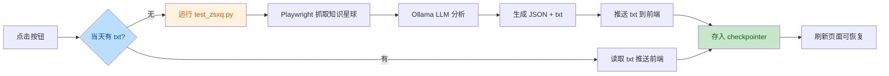

<p align="center">
  <h1 align="center">🤖 MOSS Finance Assistant</h1>
  <p align="center"><b>多智能体金融资讯助手 —— 多智能体协作 deepseek联网搜索+ 知识星球抓取 + 本地大模型分析+具有进化记忆功能的skill</b></p>
  <p align="center">
    
    
    
    
    
    
  </p>
</p>

---

## 🎯 这个项目是什么

MOSS Finance Assistant 是一个基于 **多智能体协作架构** 的金融资讯助手。它将通用 AI Agent 能力与垂直领域需求结合，核心包含两大能力：

1. **通用多智能体协作**：主智能体调度网络搜索、数据库查询、知识库检索三个子智能体，协同完成复杂任务
2. **盘前小作文热度分析**：自动抓取知识星球金融资讯，调用本地大模型（Ollama）统计股票出现频次，生成盘前热度总结

**适合人群：**
- 正在学习 LangChain / LangGraph，想找一个完整可运行的实战项目
- 对多智能体编排、Playwright 爬虫、本地大模型部署感兴趣
- 想理解 FastAPI + WebSocket + Agent 如何组合成真实可用的系统

---

## ✨ 核心功能

### 1. 多智能体协作系统

主智能体像团队负责人一样调度三个子智能体协同工作，全过程通过 WebSocket 实时推送进度到前端。

### 2. 盘前小作文热度分析

一键抓取知识星球金融资讯，本地大模型分析股票热度，生成总结报告：

- **抓取**：Playwright 驱动浏览器登录知识星球，拦截 API 响应获取主题内容
- **分析**：调用 Ollama 本地大模型（qwen3:8b），用 JSON Schema 约束输出结构化结果
- **统计**：Python 统计股票出现次数，按热度排序
- **展示**：总结内容推送到前端对话区，靠右显示，刷新不丢失（持久化到会话历史）
- **复用**：当天已有总结时自动跳过抓取，秒级返回

---

## 🏗️ 架构一览

```
用户请求 (POST /api/task 或 盘前小作文热度按钮)
    │
    ▼
api/server.py                    ← FastAPI 路由 + WebSocket
    │
    ├──→ 通用任务: agent/main_agent.py    ← 主智能体异步流式执行
    │        ├──→ 子智能体: 网络搜索 / 数据库查询 / 知识库检索
    │        └──→ 工具: Markdown生成 / PDF转换 / 文件读取
    │
    └──→ 盘前小作文: _run_zsxq_analysis()
             ├──→ 复用当天 txt? ──是──→ 直接推送前端
             └──→ 否 ──→ test_zsxq.py 子进程
                          ├──→ tools/zsxq_tool.py (Playwright 抓取)
                          ├──→ Ollama qwen3:8b (LLM 分析)
                          └──→ zsxq_news/*.txt (总结输出)
    │
    ▼ (每步通过 WebSocket 实时推送)
api/monitor.py                   ← 事件埋点 + WebSocket 连接池
    │
    ▼
前端实时显示进度 + 最终结果
```

### 盘前小作文热度数据流



---

## 🚀 快速开始

### 环境要求

- Python 3.10+
- OpenAI 兼容的 LLM API Key（阿里云百炼 / DeepSeek / OpenAI）
- Tavily API Key（[免费注册](https://tavily.com)）
- [Ollama](https://ollama.com)（盘前小作文热度功能需要，本地运行大模型）
- Playwright 浏览器（盘前小作文热度功能需要）

### 第一步：克隆 + 装依赖

```bash
git clone https://github.com/arnoldli001/moss-finance-assistant.git
cd moss-finance-assistant
pip install -r requirements.txt
```

### 第二步：安装 Playwright（盘前小作文热度功能需要）

```bash
pip install playwright
playwright install chromium
```

### 第三步：配置 Ollama 本地大模型

```bash
# 安装 Ollama 后拉取模型
ollama pull qwen3:8b
```

### 第四步：配环境变量

```bash
cp .env.example .env
```

编辑 `.env`，核心配置：

```env
# LLM 服务（必填）
OPENAI_BASE_URL=https://dashscope.aliyuncs.com/compatible-mode/v1
OPENAI_API_KEY=sk-xxxxxxxxxxxxxxxx
LLM_QWEN_MAX=qwen-max

# 网络搜索（必填）
TAVILY_API_KEY=tvly-dev-xxxxxxxxxxxxxxxx

# Ollama 本地大模型（盘前小作文热度功能需要）
OLLAMA_HOST=http://localhost:11434
OLLAMA_MODEL=qwen3:8b

# 知星球抓取（盘前小作文热度功能需要）
ZSXQ_GROUP_ID=你的星球ID
ZSXQ_COOKIE=你的登录Cookie
```

### 第五步：启动

```bash
python api/server.py
```

访问 `http://localhost:8000` 打开前端界面。

---

## 📖 推荐阅读顺序

| 顺序 | 文件 | 重点看什么 |
|------|------|-----------|
| 1 | `agent/llm.py` | LLM 模型初始化 |
| 2 | `prompt/prompts.yml` | 系统提示词如何约束 Agent 行为 |
| 3 | `agent/subagents/network_search_agent.py` | 最简单的子智能体 |
| 4 | `tools/tavily_tool.py` | @tool 完整写法 + 埋点 |
| 5 | `agent/main_agent.py` | 主智能体编排 + 异步流式执行 + 会话历史 |
| 6 | `api/server.py` | FastAPI + Agent 结合 + 盘前小作文热度接口 |
| 7 | `api/monitor.py` | WebSocket 实时推送 + 事件埋点 |
| 8 | `api/context.py` | ContextVar 协程级数据隔离 |
| 9 | `test_zsxq.py` | 知识星球抓取 + Ollama 分析 + 股票热度统计 |
| 10 | `tools/zsxq_tool.py` | Playwright 浏览器自动化抓取 |

---

## 📁 项目结构

```
moss_finance_assistant/
│
├── agent/                          # 智能体层
│   ├── llm.py                      # 模型初始化
│   ├── prompts.py                  # 提示词加载
│   ├── main_agent.py               # 主智能体 + 异步执行 + 会话历史
│   └── subagents/                  # 子智能体
│       ├── network_search_agent.py
│       ├── database_query_agent.py
│       └── knowledge_base_agent.py
│
├── api/                            # Web 接口层
│   ├── server.py                   # FastAPI 入口 + 盘前小作文热度接口
│   ├── context.py                  # ContextVar 协程隔离
│   └── monitor.py                  # WebSocket 监控 + 事件推送
│
├── tools/                          # 工具函数
│   ├── tavily_tool.py              # 网络搜索
│   ├── db_tools.py                 # 数据库查询
│   ├── ragflow_tools.py            # RAGFlow 知识库
│   ├── markdown_tools.py           # Markdown 生成
│   ├── pdf_tools.py                # PDF 转换
│   ├── upload_file_read_tool.py    # 文件读取
│   └── zsxq_tool.py                # ★ 知识星球 Playwright 抓取
│
├── test_zsxq.py                    # ★ 盘前小作文热度分析脚本
├── zsxq_news/                      # 抓取结果输出（运行时生成，已 gitignore）
├── zsxq-skill/                     # 知识星球运营 Skill 定义
│
├── utils/                          # 工具层
│   ├── path_utils.py               # 路径安全解析
│   └── word_converter.py           # Word 转换
│
├── prompt/prompts.yml              # 提示词配置
├── requirements.txt                # 依赖清单
└── .env.example                    # 环境变量模板
```

---

## 🔧 技术栈

| 层级 | 技术 | 说明 |
|------|------|------|
| Agent 框架 | **deepagents** (LangChain) | 多智能体编排 |
| LLM 接入 | LangChain + OpenAI 兼容协议 | 适配多种模型 |
| 本地大模型 | **Ollama** (qwen3:8b) | 盘前小作文热度分析，无需 API 费用 |
| Web 框架 | FastAPI + Uvicorn | 异步 HTTP + WebSocket |
| 浏览器自动化 | **Playwright** | 知识星球内容抓取 |
| 搜索引擎 | Tavily API | AI 专用搜索 |
| 知识库 | RAGFlow | 开源 RAG 引擎 |
| 数据库 | MySQL | Agent 自动写 SQL |
| 持久化 | AsyncSqliteSaver (LangGraph) | 对话历史跨重启保留 |

---

## 🔌 API 接口

| 方法 | 路径 | 说明 |
|------|------|------|
| POST | `/api/task` | 通用任务（多智能体协作） |
| POST | `/api/zsxq-analysis` | 盘前小作文热度分析 |
| GET | `/api/sessions` | 获取会话列表 |
| GET | `/api/sessions/{id}/history` | 获取会话历史 |
| WS | `/ws/{thread_id}` | WebSocket 实时推送 |
| POST | `/api/upload` | 上传文件 |

---

## ❓ FAQ

### Q: 盘前小作文热度功能需要联网吗？

**A:** 需要。抓取知识星球内容需要访问 zsxq.com。但 LLM 分析使用本地 Ollama，不需要调用外部 API。

### Q: 没有 RAGFlow 和 MySQL 能跑吗？

**A:** 能。主智能体会自动跳过没有的服务，只配 LLM + Tavily 就能体验核心链路。

### Q: 盘前小作文热度的总结会保存吗？

**A:** 会。总结以 `YYYYMMDDHHMMSS.txt` 格式保存到 `zsxq_news/` 目录，同时存入会话历史（checkpointer），刷新页面也不丢失。当天已有总结时自动复用，跳过抓取。

### Q: 为什么用 Ollama 而不是直接调 API？

**A:** 股票热度分析需要处理大量文本，用本地大模型零成本、低延迟，且数据不出本机。

---

## 📄 License

MIT License
# moss-finance-assistant

